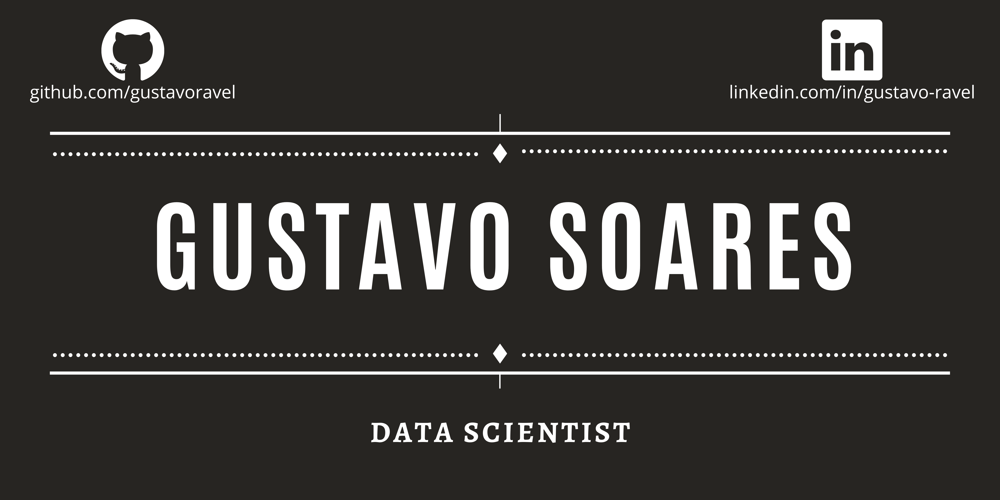

 
 

  
# Gustavo Soares

As a Data Scientist, I'm eager to find new problems to solve with Artificial Intelligence and face new challenges. Today my whole carreer is focused on ease the understanding of information to other people, however complex they may be. Show how the numbers tell stories, describe the present and predict the future, all of this is fascinating! 

My educational background includes a BSc Computer Science from Universidade Paulista (UNIP), one of the most respected universities in Brazil and online courses in Datacamp, Udacity, Khan Academy and Sigmoidal.ai, institutions focused on data science and mathematics.

Links:
  * [LinkedIn](https://www.linkedin.com/in/gustavo-ravel/)
  * [Medium](https://medium.com/@ravelsoares.lima)
  
## Projects:

* Analyzing London Airbnb Data (Exploratory Data Analysis) - https://bit.ly/3qWwBI1
